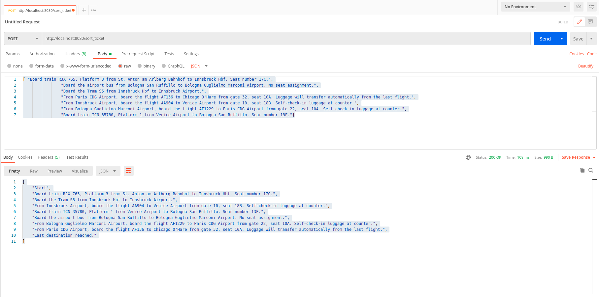

# Kevin Problem

This is a sample Java / Maven / Spring Boot (version 1.5.6) application that help you to sort a list of tickets.
The sorting algorithm works based on sorting by selection. That is, for each ticket X, the  ticket X+1  is searched, which contains the destination of the X ticket.

## How to Run

This application is packaged as a jar. You run it using the ```java -jar``` command.

* Clone this repository
* Make sure you are using JDK 11.
* You can build the project and run the tests by running ```mvn clean package```
* Once successfully built, you can run the service by one of these two methods:
```
        java - jar target/kevin-0.0.1-SNAPSHOT.jar
or
        mvn spring-boot:run
```

Once the application runs you should see something like this

```
2021-10-16 11:29:51.271  INFO 29242 --- [           main] o.s.b.w.embedded.tomcat.TomcatWebServer  : Tomcat started on port(s): 8080 (http) with context path ''
2021-10-16 11:29:51.277  INFO 29242 --- [           main] ro.problem.kevin.KevinEmagApplication    : Started KevinEmagApplication in 0.806 seconds (JVM running for 1.136)
```

## About the Service

The service is just a REST service. You can call some REST endpoints defined in ```ro.problem.kevin.controller.TicketController``` on **port 8080**. (see below)

### Create a hotel resource

```
POST /sort_ticket
Accept: application/json
Content-Type: application/json
[ 
    "Board train RJX 765, Platform 3 from St. Anton am Arlberg Bahnhof to Innsbruck Hbf. Seat number 17C.",
    "Board the airport bus from Bologna San Ruffillo to Bologna Guglielmo Marconi Airport. No seat assignment.",
    "Board the Tram S5 from Innsbruck Hbf to Innsbruck Airport.",
    "From Paris CDG Airport, board the flight AF136 to Chicago O'Hare from gate 32, seat 10A. Luggage will transfer automatically from the last flight.",
    "From Innsbruck Airport, board the flight AA904 to Venice Airport from gate 10, seat 18B. Self-check-in luggage at counter.",
    "From Bologna Guglielmo Marconi Airport, board the flight AF1229 to Paris CDG Airport from gate 22, seat 10A. Self-check-in luggage at counter.",
    "Board train ICN 35780, Platform 1 from Venice Airport to Bologna San Ruffillo. Sear number 13F."
]

RESPONSE: HTTP 200 
BODY:
[
    "Start",
    "Board train RJX 765, Platform 3 from St. Anton am Arlberg Bahnhof to Innsbruck Hbf. Seat number 17C.",
    "Board the Tram S5 from Innsbruck Hbf to Innsbruck Airport.",
    "From Innsbruck Airport, board the flight AA904 to Venice Airport from gate 10, seat 18B. Self-check-in luggage at counter.",
    "Board train ICN 35780, Platform 1 from Venice Airport to Bologna San Ruffillo. Sear number 13F.",
    "Board the airport bus from Bologna San Ruffillo to Bologna Guglielmo Marconi Airport. No seat assignment.",
    "From Bologna Guglielmo Marconi Airport, board the flight AF1229 to Paris CDG Airport from gate 22, seat 10A. Self-check-in luggage at counter.",
    "From Paris CDG Airport, board the flight AF136 to Chicago O'Hare from gate 32, seat 10A. Luggage will transfer automatically from the last flight.",
    "Last destination reached."
]
```

### To view Swagger 2 API docs

Run the server and browse to http://localhost:8080/swagger-ui/

### Postman
```
Input:
[ "Board train RJX 765, Platform 3 from St. Anton am Arlberg Bahnhof to Innsbruck Hbf. Seat number 17C.",
                "Board the airport bus from Bologna San Ruffillo to Bologna Guglielmo Marconi Airport. No seat assignment.",
                "Board the Tram S5 from Innsbruck Hbf to Innsbruck Airport.",
                "From Paris CDG Airport, board the flight AF136 to Chicago O'Hare from gate 32, seat 10A. Luggage will transfer automatically from the last flight.",
                "From Innsbruck Airport, board the flight AA904 to Venice Airport from gate 10, seat 18B. Self-check-in luggage at counter.",
                "From Bologna Guglielmo Marconi Airport, board the flight AF1229 to Paris CDG Airport from gate 22, seat 10A. Self-check-in luggage at counter.",
                "Board train ICN 35780, Platform 1 from Venice Airport to Bologna San Ruffillo. Sear number 13F."]

Output:
[
    "Start",
    "Board train RJX 765, Platform 3 from St. Anton am Arlberg Bahnhof to Innsbruck Hbf. Seat number 17C.",
    "Board the Tram S5 from Innsbruck Hbf to Innsbruck Airport.",
    "From Innsbruck Airport, board the flight AA904 to Venice Airport from gate 10, seat 18B. Self-check-in luggage at counter.",
    "Board train ICN 35780, Platform 1 from Venice Airport to Bologna San Ruffillo. Sear number 13F.",
    "Board the airport bus from Bologna San Ruffillo to Bologna Guglielmo Marconi Airport. No seat assignment.",
    "From Bologna Guglielmo Marconi Airport, board the flight AF1229 to Paris CDG Airport from gate 22, seat 10A. Self-check-in luggage at counter.",
    "From Paris CDG Airport, board the flight AF136 to Chicago O'Hare from gate 32, seat 10A. Luggage will transfer automatically from the last flight.",
    "Last destination reached."
]
```



